# Virtual Threads in Java 21: A Comprehensive Guide

## 1. Introduction
   Java 21 introduces Virtual Threads, a groundbreaking feature under [Project Loom](https://openjdk.org/projects/loom/) aimed at revolutionizing concurrency in Java applications. Virtual threads are lightweight threads that dramatically improve the scalability of concurrent applications by allowing a vast number of threads to be managed efficiently. This guide explores virtual threads in depth, providing valuable examples and insights into their benefits, appropriate use cases, limitations, and internal workings within the Java Virtual Machine (JVM).


## 2. Understanding Threads in Java

```plantuml
@startuml
skinparam style strictuml

title Thread-per-Request Style and Scalability Challenges

left to right direction

' Define main components
rectangle "Server Application" as Server {
    rectangle "Thread-per-Request Style" as TPR {
        [Request 1] -down-> (Thread 1)
        [Request 2] -down-> (Thread 2)
        [Request N] -down-> (Thread N)
    }
}

' Show the advantages
note right of TPR
    Advantages:
    - Easy to understand
    - Easy to program
    - Aligns application and platform concurrency
end note

' Scalability governed by Little's Law
cloud "Little's Law:\nConcurrency = Throughput × Latency" as LittlesLaw
LittlesLaw -up-> TPR

' Show limitations of OS threads
rectangle "OS Threads Limitations" as Limitations
note right of Limitations
    - High resource cost
    - Limited number
    - Bottleneck before CPU/network
end note

Limitations -left-> TPR

' Thread Pooling
rectangle "Thread Pooling" as Pooling
Pooling -down-> Limitations
note bottom of Pooling
    - Reduces thread creation cost
    - Does not increase total threads
end note

' Application Throughput Capped
rectangle "Capped Throughput" as Capped
Capped -left-> Limitations

@enduml
```



###   2.1 Platform Threads
   - Definition: Traditional Java threads are known as platform threads. Each platform thread is a wrapper around an operating system (OS) thread.
   - Characteristics:
     - Heavyweight: Creating a platform thread is resource-intensive.
     - Limited Scalability: Managing thousands of platform threads can lead to performance bottlenecks due to context switching and scheduling overhead.
     - Blocking Issues: Blocking operations (like I/O) consume valuable OS threads, limiting concurrency.
###   2.2 The Need for Virtual Threads
   - Concurrency Challenges: Modern applications often require handling thousands or millions of concurrent tasks, especially in server-side applications dealing with I/O-bound operations.
   - Limitations of Non-Blocking I/O: As a workaround, developers used asynchronous or non-blocking I/O, which introduces complexity and makes code harder to read and maintain.
   - Goal: Simplify concurrency by allowing developers to write straightforward blocking code without sacrificing performance or scalability.
## 3. What Are Virtual Threads?
   - Definition: Virtual threads are lightweight threads managed by the JVM rather than the OS.
   - Key Features:
     - Lightweight: They are cheap to create and manage, allowing millions of virtual threads in a single JVM.
      - Non-Blocking Operations: Blocking a virtual thread (e.g., during I/O operations) does not block an OS thread, freeing up resources.
      - Compatibility: Virtual threads are designed to work seamlessly with existing Java code.
## 4. Benefits of Virtual Threads
###   4.1 Lightweight and Scalable Concurrency
   - Massive Parallelism: You can create millions of virtual threads without overwhelming system resources.
   - Reduced Overhead: Lower memory footprint per thread compared to platform threads.
###   4.2 Simplified Thread Management
   - Easier Concurrency Model: Write code in a sequential, blocking style without complex asynchronous patterns.
   - Maintainability: Code is more readable and maintainable, reducing bugs and development time.
###   4.3 Improved Resource Utilization
   - Efficient Scheduling: The JVM schedules virtual threads efficiently over a pool of OS threads.
   - Non-Blocking I/O Handling: I/O operations do not tie up OS threads, leading to better CPU utilization.
## 5. How Virtual Threads Work Internally
   Understanding the internal workings of virtual threads helps in appreciating their benefits and limitations.

### 5.1 Continuation-Based Architecture
- Continuations: Virtual threads are built on top of continuations, a feature that allows suspending and resuming computations.
- Execution State: When a virtual thread performs a blocking operation, its execution state is captured and stored.
- Resumption: Once the blocking operation completes, the virtual thread's execution state is resumed.
### 5.2 Scheduling and Execution
- JVM Scheduler: The JVM includes a scheduler that maps virtual threads onto a smaller pool of OS threads.
- Work-Stealing Algorithm: The scheduler uses efficient algorithms to balance the load across OS threads.
- Non-Blocking Operations: When a virtual thread blocks, the OS thread can pick up another virtual thread, maximizing resource usage.
### 5.3 Interaction with the OS
- Minimal OS Involvement: The OS is unaware of virtual threads; it only manages the underlying OS threads.
- Reduced Context Switching: Since virtual threads are managed by the JVM, context switches are cheaper compared to OS thread switches.
## 6. Using Virtual Threads in Java 21
###   6.1 Creating Virtual Threads
   Java 21 introduces new APIs for creating and managing virtual threads.

Creating a Single Virtual Thread:
```java
Thread virtualThread = Thread.startVirtualThread(() -> {
    // Task to run in virtual thread
});
```
Alternative Syntax:
```java
Thread virtualThread = Thread.ofVirtual().start(() -> {
    // Task to run in virtual thread
});
```
### 6.2 Virtual Thread Executors
For task-based concurrency, you can use executors that utilize virtual threads.

Creating a Virtual Thread Executor:
```java
ExecutorService executor = Executors.newVirtualThreadPerTaskExecutor();
```
- Usage: Submit tasks to the executor, and it will run each task in a new virtual thread.
## 6.3 Examples
Example 1: Simple Virtual Thread
```java
public class SimpleVirtualThread {
    public static void main(String[] args) throws InterruptedException {
        Thread virtualThread = Thread.startVirtualThread(() -> {
            System.out.println("Hello from virtual thread: " + Thread.currentThread());
        });
        virtualThread.join();
    }
}
```
Example 2: Virtual Threads for Concurrent Tasks
```java
public class ConcurrentVirtualThreads {
    public static void main(String[] args) throws InterruptedException {
        int numberOfTasks = 1000;
        List<Thread> threads = new ArrayList<>();

        for (int i = 0; i < numberOfTasks; i++) {
            Thread thread = Thread.startVirtualThread(() -> {
                try {
                    // Simulate a blocking operation
                    Thread.sleep(1000);
                    System.out.println("Task completed by: " + Thread.currentThread());
                } catch (InterruptedException e) {
                    throw new RuntimeException(e);
                }
            });
            threads.add(thread);
        }

        // Wait for all threads to finish
        for (Thread thread : threads) {
            thread.join();
        }
    }
}
```

Example 3: Using Virtual Thread Executor
```java
import java.util.concurrent.ExecutorService;
import java.util.concurrent.Executors;
import java.util.concurrent.TimeUnit;

public class VirtualThreadExecutorExample {
    public static void main(String[] args) throws InterruptedException {
        ExecutorService executor = Executors.newVirtualThreadPerTaskExecutor();

        for (int i = 0; i < 1000; i++) {
            executor.submit(() -> {
                try {
                    // Simulate a task
                    Thread.sleep(1000);
                    System.out.println("Task executed by: " + Thread.currentThread());
                } catch (InterruptedException e) {
                    throw new RuntimeException(e);
                }
            });
        }

        executor.shutdown();
        executor.awaitTermination(10, TimeUnit.SECONDS);
    }
}
```
## 7. When to Use Virtual Threads
- I/O-Bound Applications: Ideal for applications with high concurrency and I/O-bound tasks, such as web servers, database clients, and network applications.
- Microservices Architecture: Services that handle numerous simultaneous requests can benefit from virtual threads.
- Simplifying Asynchronous Code: Replace complex asynchronous code with straightforward blocking code without sacrificing performance.
- High Concurrency: When you need to manage tens of thousands or millions of concurrent tasks.

## 8. When Not to Use Virtual Threads
- CPU-Bound Tasks:
  - Explanation: Virtual threads do not provide benefits for CPU-intensive tasks since the bottleneck is the CPU, not thread management.
  - Recommendation: Use traditional platform threads or parallel streams for CPU-bound workloads.
- Heavy Use of ThreadLocals:
  - Explanation: Virtual threads may reuse underlying OS threads, leading to unexpected behavior with ThreadLocal variables.
  - Recommendation: Avoid relying on ThreadLocal for storing state in virtual threads.
- Synchronized Blocks and Locks:
  - Explanation: Holding locks for extended periods can negate the benefits of virtual threads, as they may block underlying OS threads.
  - Recommendation: Minimize synchronized blocks and consider using concurrent data structures.
- Low Concurrency Applications:
  - Explanation: If your application doesn't require high levels of concurrency, the overhead of virtual threads may not provide significant benefits.
  - Recommendation: Stick with platform threads for simpler concurrency needs.
- Native Code and JNI Calls:
  - Explanation: Blocking in native code or during Java Native Interface (JNI) calls can block the underlying OS thread.
  - Recommendation: Be cautious when virtual threads interact with native libraries.

## 9. Best Practices
- Avoid ThreadLocal Variables: Pass state explicitly or use other concurrency-safe mechanisms.
- Use Executors for Task Management: Leverage virtual thread executors for managing large numbers of tasks.
- Minimize Blocking Synchronization: Use non-blocking algorithms and concurrent collections when possible.
- Monitor Resource Usage: Keep an eye on memory and CPU usage, especially when creating millions of virtual threads.
- Stay Updated: As virtual threads are a new feature, keep abreast of the latest best practices and updates from the Java community.